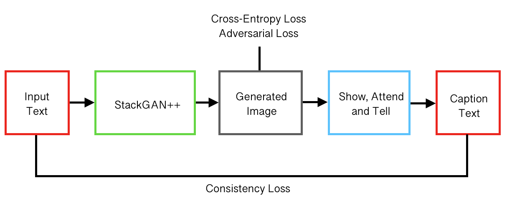
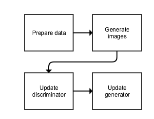
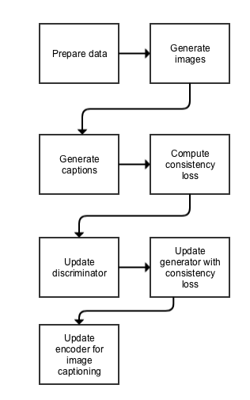
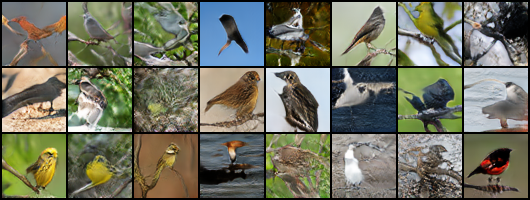

# Combined "CycleStein" Model

- [StackGAN++: Pytorch implementation](https://github.com/hanzhanggit/StackGAN-v2)

- [Show, Attend, and Tell: Sgrvinod Pytorch implementation](https://github.com/sgrvinod/a-PyTorch-Tutorial-to-Image-Captioning)

- [Inception score evaluation](https://github.com/hanzhanggit/StackGAN-inception-model)

StackGAN++                 |  Combined "CycleStein" Model
:-------------------------:|:-------------------------:
     |    

### Dependencies
python 3.x
Pytorch
`pip install` the following packages:`tensorboard`,`python-dateutil`,`easydict`,`pandas`,`torchfile`

**Data**

1. Download our preprocessed char-CNN-RNN text embeddings for [birds](https://drive.google.com
2. Download the [birds](http://www.vision.caltech.edu/visipedia/CUB-200-2011.html) image data. Extract them to `data/birds/`

**Training**

- Train a StackGAN-v2 model on the bird (CUB) dataset using our preprocessed embeddings:
  -  `python main.py --cfg cfg/birds_3stages.yml --gpu 0`
- `*.yml` files are example configuration files for training/evaluation our models.

**Pretrained Model**
- [StackGAN-v2 for bird](https://drive.google.com/open?id=1s5Yf3nFiXx0lltMFOiJWB6s1LP24RcwH). Download and save it to `models/` (The [inception score](https://github.com/hanzhanggit/StackGAN-inception-model) for this Model is 4.04±0.05)

**Evaluating**
- Run `python main.py --cfg cfg/eval_birds.yml --gpu 1` to generate samples from captions in birds validation set.
- Change the `eval_*.yml` files to generate images from other pre-trained models. 

**Generated Bird Examples**

**References**

- [StackGAN++: Realistic Image Synthesis with Stacked Generative Adversarial Networks](https://arxiv.org/abs/1710.10916) 
- [Show, Attend and Tell: Neural Image Caption Generation with Visual Attention](https://arxiv.org/abs/1502.03044)

